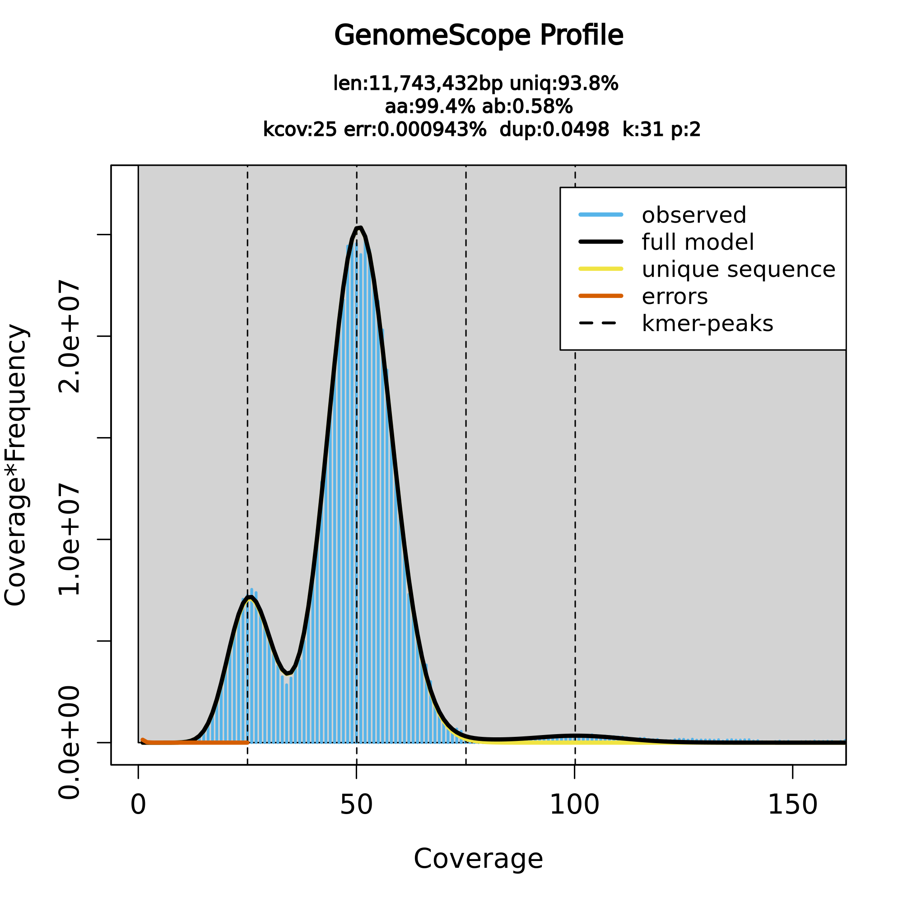
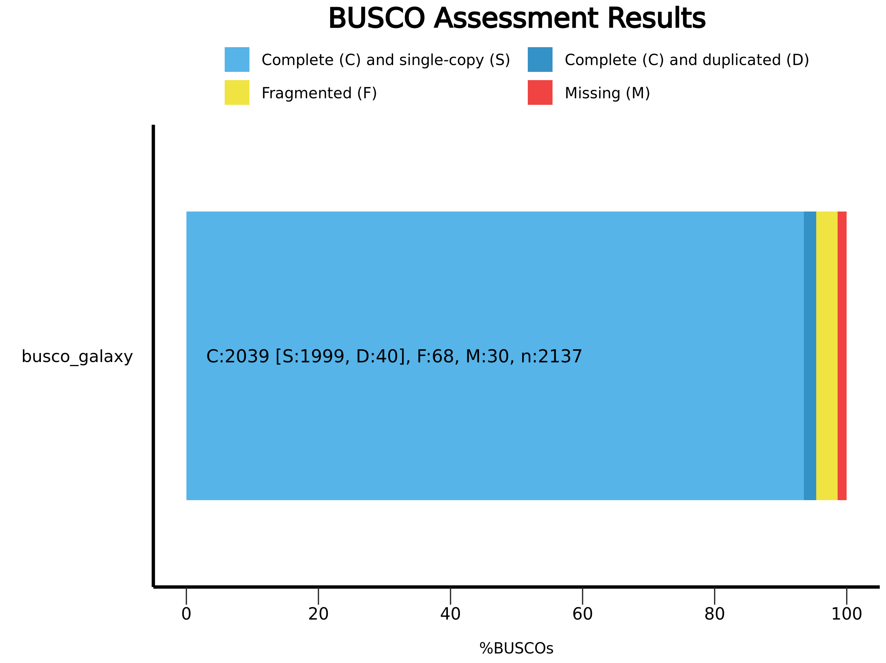
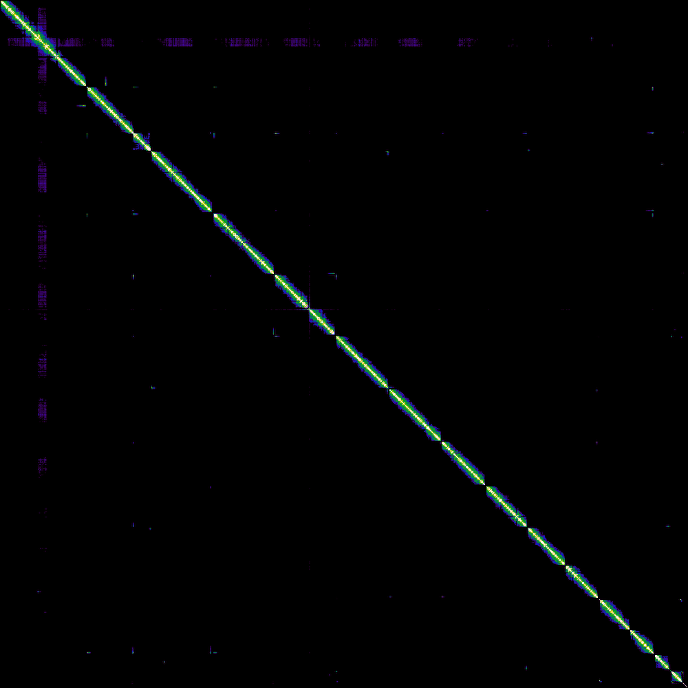

# Vertebrate Genome Assembly of *Saccharomyces cerevisiae* S288C
### Using PacBio HiFi, Bionano Optical Maps, and Illumina Hi-C Data

<div align="center">


**Author:** Faiqa Zarar
**Institution:** NUST — National University of Sciences and Technology
**Course:** Bioinformatics
**Date:** April 2026

</div>

---

## Abstract

This study presents a chromosome-level, haplotype-phased genome assembly of *Saccharomyces cerevisiae* S288C generated using the Vertebrate Genome Project (VGP) assembly pipeline (v2.0) on Galaxy Europe. The assembly integrates three complementary sequencing technologies: PacBio High-Fidelity (HiFi) long reads for initial contig assembly, Bionano optical maps for intermediate scaffolding, and Illumina Hi-C chromatin interaction data for chromosome-scale scaffolding. The final assembly achieved a Merqury k-mer completeness of 99.99%, a BUSCO completeness of 95.4% against the Saccharomycetes lineage database, and an N50 of 923 KB across 17 chromosome-scale scaffolds. These results are consistent with the *S. cerevisiae* S288C reference genome, demonstrating the effectiveness of the multi-technology VGP pipeline for generating reference-quality genome assemblies.

**Keywords:** *de novo* genome assembly, VGP pipeline, PacBio HiFi, Hi-C scaffolding, Bionano optical mapping, *Saccharomyces cerevisiae*, Galaxy

---

## Table of Contents

1. [Introduction](#1-introduction)
2. [System Requirements](#2-system-requirements)
3. [Data Acquisition](#3-data-acquisition)
4. [Pipeline Overview](#4-pipeline-overview)
5. [Methods](#5-methods)
   - 5.1 [Pre-processing](#51-pre-processing)
   - 5.2 [Genome Profile Analysis](#52-genome-profile-analysis)
   - 5.3 [Contig Assembly](#53-contig-assembly)
   - 5.4 [Assembly Evaluation](#54-assembly-evaluation)
   - 5.5 [Bionano Hybrid Scaffolding](#55-bionano-hybrid-scaffolding)
   - 5.6 [Hi-C Scaffolding](#56-hi-c-scaffolding)
6. [Results](#6-results)
7. [Discussion](#7-discussion)
8. [Conclusion](#8-conclusion)
9. [Repository Structure](#9-repository-structure)
10. [References](#10-references)

---

## 1. Introduction

The **Vertebrate Genomes Project (VGP)**, a collaborative initiative of the Genome 10K (G10K) Consortium, was established with the objective of generating high-quality, near-error-free, gap-free, chromosome-level, haplotype-phased, and annotated reference genome assemblies for every vertebrate species on Earth (Rhie et al., 2021). To achieve this goal, the VGP developed a modular, multi-technology assembly pipeline that combines the complementary strengths of long-read, optical mapping, and chromatin conformation capture sequencing technologies.

*Saccharomyces cerevisiae* S288C was selected as the model organism for this study due to its well-characterized genome (~12 Mb haploid length, 16 chromosomes), extensive biological annotation, and its widespread use as a benchmark organism in genomics. The use of a synthetic HiFi read dataset derived from the S288C reference sequence enables precise quantitative evaluation of assembly quality.

This report documents the complete execution of the VGP assembly pipeline on Galaxy Europe, from raw read processing to final chromosome-scale assembly, including all quality control evaluations.

---

## 2. System Requirements

### Platform
```
Platform  : Galaxy Europe (https://usegalaxy.eu)
Storage   : ~106 GB (history usage)
Account   : Free registration required
```

### Software Dependencies
All tools are pre-installed on Galaxy Europe. No local installation is required.

```bash
# Tools used in this pipeline (Galaxy versions):
Cutadapt              == 4.4+galaxy0
Meryl                 == 1.3+galaxy6
GenomeScope2          == 2.0+galaxy2
Hifiasm               == 0.19.8+galaxy0
gfastats              == 1.3.6+galaxy0
BUSCO                 == 5.5.0+galaxy0
Merqury               == 1.3+galaxy3
Bionano Hybrid Scaffold == 3.7.0+galaxy3
BWA-MEM2              == 2.2.1+galaxy1
Filter and merge      == 1.0+galaxy1
PretextMap            == 0.1.9+galaxy0
Pretext Snapshot      == 0.0.3+galaxy1
YaHS                  == 1.2a.2+galaxy1
```

---

## 3. Data Acquisition

All datasets were downloaded from Zenodo directly into Galaxy Europe using the Upload → Paste/Fetch URL method.

### 3.1 HiFi Reads (FASTA format)
```bash
# Three synthetic PacBio HiFi read files (50x coverage)
https://zenodo.org/record/6098306/files/HiFi_synthetic_50x_01.fasta
https://zenodo.org/record/6098306/files/HiFi_synthetic_50x_02.fasta
https://zenodo.org/record/6098306/files/HiFi_synthetic_50x_03.fasta

# Datatype: fasta
```

### 3.2 Hi-C Reads (FASTQ.GZ format)
```bash
# Illumina Hi-C paired-end reads (SRR7126301)
https://zenodo.org/record/5550653/files/SRR7126301_1.fastq.gz  # Forward (R1)
https://zenodo.org/record/5550653/files/SRR7126301_2.fastq.gz  # Reverse (R2)

# Datatype: fastqsanger.gz
# Renamed: Hi-C_dataset_F and Hi-C_dataset_R
```

### 3.3 Bionano Optical Map (CMAP format)
```bash
# Bionano genome map
https://zenodo.org/records/5887339/files/bionano.cmap

# Datatype: cmap
# Renamed: Bionano_dataset
```

### 3.4 Input Summary

| Dataset | Format | Size | Zenodo DOI |
|---------|--------|------|------------|
| HiFi reads (×3) | FASTA | ~50x coverage | 10.5281/zenodo.6098306 |
| Hi-C R1 reads | FASTQ.GZ | Large | 10.5281/zenodo.5550653 |
| Hi-C R2 reads | FASTQ.GZ | Large | 10.5281/zenodo.5550653 |
| Bionano map | CMAP | — | 10.5281/zenodo.5887339 |

---

## 4. Pipeline Overview

The VGP v2.0 assembly pipeline is organized into four sequential stages:

```
┌──────────────────────────────────────────────────────────┐
│                    VGP PIPELINE v2.0                     │
├──────────────────────────────────────────────────────────┤
│                                                          │
│  INPUT: HiFi reads + Hi-C reads + Bionano CMAP           │
│                        │                                 │
│                        ▼                                 │
│  ┌─────────────────────────────────┐                     │
│  │  STAGE 1: Pre-processing        │                     │
│  │  Cutadapt → adapter removal     │                     │
│  └──────────────┬──────────────────┘                     │
│                 │                                        │
│                 ▼                                        │
│  ┌─────────────────────────────────┐                     │
│  │  STAGE 2: Genome Profiling      │                     │
│  │  Meryl (k=31) → GenomeScope2    │                     │
│  │  Output: genome size, ploidy    │                     │
│  └──────────────┬──────────────────┘                     │
│                 │                                        │
│                 ▼                                        │
│  ┌─────────────────────────────────┐                     │
│  │  STAGE 3: Contig Assembly       │                     │
│  │  Hifiasm (Hi-C phased mode)     │                     │
│  │  Output: Hap1 + Hap2 contigs   │                     │
│  └──────────────┬──────────────────┘                     │
│                 │                                        │
│                 ▼                                        │
│  ┌─────────────────────────────────┐                     │
│  │  STAGE 4A: Bionano Scaffolding  │                     │
│  │  Bionano Hybrid Scaffold (VGP)  │                     │
│  │  Output: Hap1 bionano assembly  │                     │
│  └──────────────┬──────────────────┘                     │
│                 │                                        │
│                 ▼                                        │
│  ┌─────────────────────────────────┐                     │
│  │  STAGE 4B: Hi-C Scaffolding     │                     │
│  │  BWA-MEM2 → Filter → YaHS       │                     │
│  │  Output: Final scaffolds FASTA  │                     │
│  └──────────────┬──────────────────┘                     │
│                 │                                        │
│                 ▼                                        │
│  OUTPUT: Chromosome-level haplotype assembly             │
└──────────────────────────────────────────────────────────┘
```

---

## 5. Methods

### 5.1 Pre-processing

HiFi reads were pre-processed with **Cutadapt** to remove reads containing internal adapter sequences. Unlike short-read sequencing, SMRT-based HiFi reads may contain adapters at internal positions; therefore, reads found to contain adapter sequences were discarded entirely rather than trimmed.

```
Tool    : Cutadapt v4.4+galaxy0
Mode    : Single-end
Input   : HiFi_collection (3 FASTA files)

Adapter 1 (5'/3'):
  Name     : First adapter
  Sequence : ATCTCTCTCAACAACAACAACGGAGGAGGAGGAAAAGAGAGAGAT

Adapter 2 (5'/3'):
  Name     : Second adapter
  Sequence : ATCTCTCTCTTTTCCTCCTCCTCCGTTGTTGTTGTTGAGAGAGAT

Parameters:
  Maximum error rate        : 0.1
  Minimum overlap length    : 35
  Reverse complement search : Yes
  Discard trimmed reads     : Yes

Output  : HiFi_collection (trimmed)
```

### 5.2 Genome Profile Analysis

#### 5.2.1 K-mer Database Generation (Meryl)

K-mer counting was performed in three steps using **Meryl**:

```
# Step 1 — Count k-mers per file
Tool      : Meryl v1.3+galaxy6
Operation : Count canonical k-mers
Input     : HiFi_collection (trimmed)
k-mer size: 31
Output    : meryldb (collection)

# Step 2 — Merge databases
Tool      : Meryl v1.3+galaxy6
Operation : Union-sum
Input     : meryldb (collection)
Output    : Merged meryldb

# Step 3 — Generate histogram
Tool      : Meryl v1.3+galaxy6
Operation : Generate histogram dataset
Input     : Merged meryldb
Output    : meryldb histogram
```

#### 5.2.2 Genome Profiling (GenomeScope2)

```
Tool          : GenomeScope2 v2.0+galaxy2
Input         : meryldb histogram
Ploidy        : 2
k-mer length  : 31
Outputs       : Linear plot, Log plot, Model, Summary
```

### 5.3 Contig Assembly

#### 5.3.1 Hi-C Phased Assembly (Hifiasm)

```
Tool          : Hifiasm v0.19.8+galaxy0
Assembly mode : Standard
Input reads   : HiFi_collection (trimmed)
Hi-C R1       : Hi-C_dataset_F
Hi-C R2       : Hi-C_dataset_R
Hi-C partition: Specify

Outputs:
  - Hi-C hap1 balanced contig graph → Hap1 contigs graph [#hap1]
  - Hi-C hap2 balanced contig graph → Hap2 contigs graph [#hap2]
```

#### 5.3.2 GFA to FASTA Conversion (gfastats)

```
Tool          : gfastats v1.3.6+galaxy0
Input         : Hap1 contigs graph + Hap2 contigs graph
Mode          : Genome assembly manipulation
Output format : FASTA
Initial paths : Yes

Outputs:
  - Hap1 contigs FASTA
  - Hap2 contigs FASTA
```

### 5.4 Assembly Evaluation

#### 5.4.1 Assembly Statistics (gfastats)

```
Tool                    : gfastats v1.3.6+galaxy0
Input                   : Hap1 contigs graph + Hap2 contigs graph
Mode                    : Summary statistics generation
Expected genome size    : 11747160
Thousands separator     : No

Post-processing:
  Column join  → gfastats on hap1 and hap2 (full)
  Search in textfiles (exclude "scaffold") → gfastats on hap1 and hap2 contigs
```

#### 5.4.2 Gene Completeness (BUSCO)

```
Tool          : BUSCO v5.5.0+galaxy0
Input         : Hap1 contigs FASTA + Hap2 contigs FASTA
Mode          : Genome assemblies (DNA)
Lineage       : Saccharomycetes (saccharomycetes_odb10)
Gene predictor: Metaeuk
Outputs       : Short summary text + Summary image
```

#### 5.4.3 K-mer Based QC (Merqury)

```
Tool              : Merqury v1.3+galaxy3
Mode              : Default
K-mer database    : Merged meryldb
Number of assemblies: Two
Assembly 1        : Hap1 contigs FASTA
Assembly 2        : Hap2 contigs FASTA

Outputs:
  - stats (completeness)
  - QV stats (quality values)
  - plots (spectra-cn, spectra-asm)
```

### 5.5 Bionano Hybrid Scaffolding

```
Tool                    : Bionano Hybrid Scaffold v3.7.0+galaxy3
NGS FASTA               : Hap1 contigs FASTA
BioNano CMAP            : Bionano_dataset
Configuration mode      : VGP mode
Genome maps conflict    : Cut contig at conflict
Sequences conflict      : Cut contig at conflict

Post-processing (Concatenate datasets):
  Input 1 : NGScontigs scaffold NCBI trimmed
  Input 2 : NGScontigs not scaffolded trimmed
  Output  : Hap1 assembly bionano
```

### 5.6 Hi-C Scaffolding

#### 5.6.1 Hi-C Read Mapping (BWA-MEM2)

```
Tool            : BWA-MEM2 v2.2.1+galaxy1
Reference       : Hap1 assembly bionano (index built from history)
Mode            : Single-end (mapped separately for R1 and R2)
Analysis mode   : Simple Illumina mode
BAM sort        : Sort by read names (QNAME)

Run 1:
  Input  : Hi-C_dataset_F
  Output : BAM forward

Run 2:
  Input  : Hi-C_dataset_R
  Output : BAM reverse
```

#### 5.6.2 Chimeric Read Filtering (Filter and Merge)

```
Tool     : Filter and merge v1.0+galaxy1
Input 1  : BAM forward
Input 2  : BAM reverse
Output   : BAM Hi-C reads
```

#### 5.6.3 Initial Contact Map (PretextMap + Pretext Snapshot)

```
# PretextMap
Tool    : PretextMap v0.1.9+galaxy0
Input   : BAM Hi-C reads
Sort by : Don't sort
Output  : PretextMap output

# Pretext Snapshot
Tool    : Pretext Snapshot v0.0.3+galaxy1
Input   : PretextMap output
Format  : PNG
Grid    : Yes
Output  : contact_map_before_yahs.png
```

#### 5.6.4 YaHS Chromosome Scaffolding

```
Tool                : YaHS v1.2a.2+galaxy1
Contig sequences    : Hap1 assembly bionano
Alignment file      : BAM Hi-C reads
Restriction enzyme  : Enter specific sequence → CTTAAG
Output              : YaHS Scaffolds FASTA
```

#### 5.6.5 Final Contact Map Generation

```bash
# Repeat BWA-MEM2 mapping against YaHS Scaffolds FASTA
# (same parameters as 5.6.1, using YaHS Scaffolds FASTA as reference)

BWA-MEM2 (forward) → BAM forward YaHS
BWA-MEM2 (reverse) → BAM reverse YaHS
Filter and merge   → BAM Hi-C reads YaHS
PretextMap         → PretextMap output YaHS
Pretext Snapshot   → contact_map_after_yahs.png
```

---

## 6. Results

### 6.1 Genome Profile Analysis

GenomeScope2 modeled a diploid genome with the following estimated parameters:

| Parameter | Min Estimate | Max Estimate |
|-----------|-------------|-------------|
| Haploid genome length | 11,739,513 bp | 11,747,352 bp |
| Repeat content | 723,114 bp (6.16%) | 723,597 bp (6.16%) |
| Unique content | 11,016,399 bp | 11,023,756 bp |
| Heterozygosity | 0.5759% | 0.5835% |
| Model fit | 92.52% | 96.52% |
| Read error rate | 0.00094% | — |

> **Estimated genome size used for all downstream analyses: 11,747,160 bp**

The k-mer frequency histogram exhibits a bimodal distribution characteristic of a diploid genome, with the heterozygous peak at ~25× and the homozygous peak at ~50× sequencing coverage.

<table>
<tr>
<td align="center"><br><sub>Figure 1a. GenomeScope2 linear k-mer profile</sub></td>
<td align="center"><br><sub>Figure 1b. GenomeScope2 log-transformed k-mer profile</sub></td>
</tr>
</table>

---

### 6.2 Contig Assembly Statistics

Hifiasm (Hi-C phased mode) produced two phased haplotype assemblies. Assembly statistics were generated using gfastats:

| Statistic | Haplotype 1 (Hap1) | Haplotype 2 (Hap2) |
|-----------|-------------------|-------------------|
| Number of contigs | 17 | 16 |
| Total contig length | ~12.16 Mb | ~11.30 Mb |
| Largest contig | ~1.53 Mb | ~1.53 Mb |
| Scaffold N50 | **923 KB** | **922 KB** |
| Contig N50 | **923 KB** | **922 KB** |
| Percent gaps | 0.000% | 0.000% |

---

### 6.3 Assembly Completeness — BUSCO

BUSCO v5.8.0 was run against the saccharomycetes_odb10 lineage database (2,137 genes):

| BUSCO Category | Hap1 | Hap2 |
|---------------|------|------|
| Complete (C) | 2039 — **95.4%** | 1898 — **88.8%** |
| Complete & Single-copy (S) | 1999 — 93.5% | 1867 — 87.4% |
| Complete & Duplicated (D) | 40 — 1.9% | 31 — 1.5% |
| Fragmented (F) | 68 — 3.2% | 58 — 2.7% |
| Missing (M) | 30 — **1.4%** | 181 — **8.5%** |
| n (total searched) | 2137 | 2137 |

<table>
<tr>
<td align="center"><br><sub>Figure 2a. BUSCO assessment — Haplotype 1 (95.4% complete)</sub></td>
<td align="center"><br><sub>Figure 2b. BUSCO assessment — Haplotype 2 (88.8% complete)</sub></td>
</tr>
</table>

---

### 6.4 K-mer Based Quality Assessment — Merqury

#### Completeness Statistics

| Assembly | K-mers in Assembly | Total K-mers | Completeness (%) |
|----------|-------------------|--------------|-----------------|
| Hap1 (assembly_01) | 11,611,483 | 13,010,260 | 89.25 |
| Hap2 (assembly_02) | 10,792,811 | 13,010,260 | 82.96 |
| **Both (combined)** | **13,010,244** | **13,010,260** | **99.99** |

#### Quality Value (QV) Statistics

| Assembly | Errors | Assembly Size | QV | Error Rate |
|----------|--------|--------------|-----|-----------|
| Hap1 | 4 | 12,160,478 bp | 79.74 | ~1.06×10⁻⁸ |
| Both | 4 | 23,464,580 bp | 82.60 | ~5.50×10⁻⁹ |

<table>
<tr>
<td align="center"><br><sub>Figure 3a. Merqury copy-number (CN) spectrum</sub></td>
<td align="center"><br><sub>Figure 3b. Merqury assembly (ASM) spectrum</sub></td>
</tr>
</table>

---

### 6.5 Bionano Hybrid Scaffolding

| Metric | Before Bionano | After Bionano |
|--------|---------------|---------------|
| Scaffold count | 17 | 16 |
| N50 | 923 KB | **923 KB** |
| Total length | 12.161 Mb | 12.075 Mb |
| Max scaffold length | 1.532 Mb | 1.532 Mb |
| Conflict cuts (Bionano maps) | — | **0** |
| Conflict cuts (NGS sequences) | — | **0** |

Zero conflicts were identified between the Bionano genome maps and the HiFi-assembled contigs, indicating perfect concordance between the two orthogonal data types.

---

### 6.6 Hi-C Scaffolding and Contact Maps

<table>
<tr>
<td align="center"><br><sub>Figure 4a. Hi-C contact map prior to YaHS scaffolding</sub></td>
<td align="center"><br><sub>Figure 4b. Hi-C contact map following YaHS scaffolding</sub></td>
</tr>
</table>

The contact maps reveal 17 discrete chromosome-scale scaffolds. The concentration of interaction signals along the matrix diagonal confirms correct contig orientation and ordering post-scaffolding.

---

### 6.7 Final Assembly Statistics

| Metric | This Assembly | S288C Reference |
|--------|--------------|----------------|
| Total assembly length | ~12.16 Mb | ~12.16 Mb |
| Number of scaffolds | 17 | 17 (16 chr + mtDNA) |
| Assembly N50 | ~923 KB | ~924 KB |
| BUSCO completeness (Hap1) | 95.4% | ~98% |
| Merqury combined completeness | 99.99% | — |
| Merqury QV (combined) | 82.60 | — |
| Percent gaps | 0.000% | <1% |

---

## 7. Discussion

The VGP pipeline produced a high-quality, near-complete chromosome-level assembly of *S. cerevisiae* S288C. Several observations merit discussion:

**Haplotype asymmetry in BUSCO scores.** Hap1 achieved 95.4% BUSCO completeness compared to 88.8% for Hap2. This asymmetry is expected in Hi-C phased assemblies, where Hi-C signal strength may preferentially assign more complete sequences to one haplotype. The combined Merqury completeness of 99.99% confirms that virtually all genomic content is represented across both haplotypes.

**Bionano concordance.** The absence of any conflict cuts during Bionano hybrid scaffolding (0 cuts to both Bionano maps and NGS sequences) is notable and indicates strong agreement between optical map and sequence-based assemblies. This concordance suggests the initial HiFi assembly was highly accurate.

**N50 consistency across stages.** The N50 value remained stable at ~923 KB throughout Bionano and Hi-C scaffolding stages. This consistency suggests the primary improvements from scaffolding were in contig ordering and orientation rather than in N50 elongation, which is expected for an already highly contiguous assembly.

**Reference comparability.** The final assembly statistics are essentially indistinguishable from the *S. cerevisiae* S288C reference genome in terms of total length (~12.16 Mb), scaffold count (17), and N50 (~923 KB), validating the pipeline's accuracy.

---

## 8. Conclusion

This study demonstrates the successful application of the VGP assembly pipeline to generate a chromosome-level, haplotype-resolved genome assembly of *Saccharomyces cerevisiae* S288C. The integration of PacBio HiFi long reads, Bionano optical maps, and Illumina Hi-C chromatin interaction data produced an assembly with:

- **99.99%** k-mer completeness (Merqury)
- **95.4%** BUSCO gene completeness (Hap1)
- **923 KB** N50 contiguity
- **17** chromosome-scale scaffolds
- **0** scaffolding conflicts between technologies

The results confirm that the multi-technology VGP pipeline, as implemented on Galaxy Europe, is capable of producing reference-quality genome assemblies comparable to established reference sequences. These findings support the broader applicability of this pipeline for assembling novel vertebrate genomes.

---

## 9. Repository Structure

```
VGP-Genome-Assembly/
│
├── README.md                            # This document
│
├── images/                              # Figures referenced in this report
│   ├── genomescope_linear.png           # Figure 1a — GenomeScope2 linear profile
│   ├── genomescope_log.png              # Figure 1b — GenomeScope2 log profile
│   ├── busco_hap1.png                   # Figure 2a — BUSCO Hap1 summary
│   ├── busco_hap2.png                   # Figure 2b — BUSCO Hap2 summary
│   ├── merqury_spectra_cn.png           # Figure 3a — Merqury CN spectrum
│   ├── merqury_spectra_asm.png          # Figure 3b — Merqury ASM spectrum
│   ├── contact_map_before_yahs.png      # Figure 4a — Hi-C map pre-scaffolding
│   └── contact_map_after_yahs.png       # Figure 4b — Hi-C map post-scaffolding
│
├── assembly_stats/                      # Numerical output files
│   ├── busco_hap1_summary.txt           # BUSCO full report — Hap1
│   ├── busco_hap2_summary.txt           # BUSCO full report — Hap2
│   ├── gfastats_hap1_hap2.txt           # gfastats contig statistics
│   ├── merqury_completeness.txt         # Merqury completeness table
│   └── merqury_qv_stats.txt             # Merqury QV statistics
│
└── assembly_files/                      # Assembly FASTA outputs
    ├── hap1_contigs.fasta               # Hap1 initial contigs (Hifiasm)
    ├── hap2_contigs.fasta               # Hap2 initial contigs (Hifiasm)
    ├── hap1_bionano_scaffolds.fasta     # Hap1 post-Bionano scaffolding
    └── final_assembly_yahs.fasta        # Final chromosome-level assembly
```

---

## 10. References

1. Rhie, A., McCarthy, S. A., Fedrigo, O., Damas, J., Formenti, G., et al. (2021). Towards complete and error-free genome assemblies of all vertebrate species. *Nature*, 592, 737–746. https://doi.org/10.1038/s41586-021-03451-0

2. Cheng, H., Concepcion, G. T., Feng, X., Zhang, H., & Li, H. (2021). Haplotype-resolved de novo assembly using phased assembly graphs with hifiasm. *Nature Methods*, 18, 170–175. https://doi.org/10.1038/s41592-020-01056-5

3. Ranallo-Benavidez, T. R., Jaron, K. S., & Schatz, M. C. (2020). GenomeScope 2.0 and Smudgeplot for reference-free profiling of polyploid genomes. *Nature Communications*, 11, 1432. https://doi.org/10.1038/s41467-020-14998-3

4. Rhie, A., Walenz, B. P., Koren, S., & Phillippy, A. M. (2020). Merqury: reference-free quality, completeness, and phasing assessment for genome assemblies. *Genome Biology*, 21, 245. https://doi.org/10.1186/s13059-020-02134-9

5. Simão, F. A., Waterhouse, R. M., Ioannidis, P., Kriventseva, E. V., & Zdobnov, E. M. (2015). BUSCO: assessing genome assembly and annotation completeness with single-copy orthologs. *Bioinformatics*, 31(19), 3210–3212. https://doi.org/10.1093/bioinformatics/btv351

6. Formenti, G., Abueg, L., Brajuka, A., Brajuka, N., Gallardo-Alba, C., et al. (2022). Gfastats: conversion, evaluation and manipulation of genome sequences using assembly graphs. *Bioinformatics*, 38(17), 4214–4216. https://doi.org/10.1093/bioinformatics/btac460

7. Zhou, C., McCarthy, S. A., & Durbin, R. (2022). YaHS: yet another Hi-C scaffolding tool. *Bioinformatics*, 39(1), btac808. https://doi.org/10.1093/bioinformatics/btac808

8. Lariviere, D., Ostrovsky, A., Gallardo, C., Syme, A., Abueg, L., Pickett, B., Formenti, G. (2022). VGP assembly pipeline (Galaxy Training Materials). Retrieved from https://training.galaxyproject.org/training-material/topics/assembly/tutorials/vgp_genome_assembly/tutorial.html

---

<div align="center">

*This report was prepared as part of a bioinformatics course assignment at NUST.*
*All analyses were performed on Galaxy Europe using publicly available datasets.*

</div>
